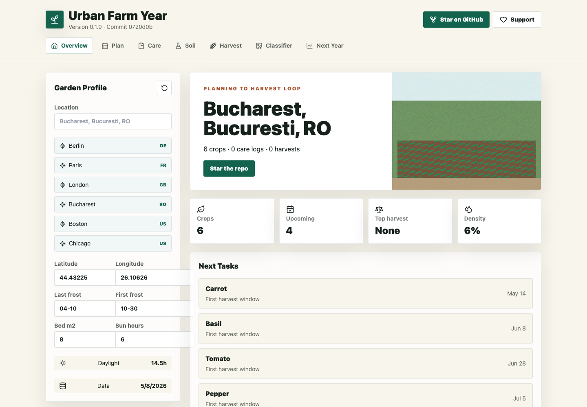
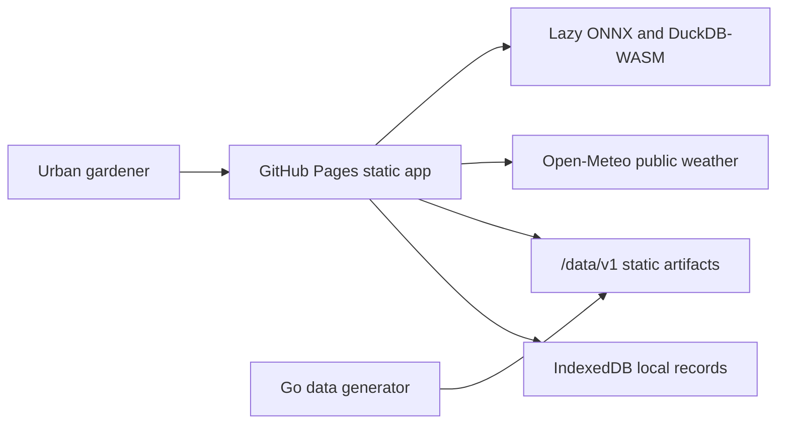

# Urban Farm Year


Live site:

https://baditaflorin.github.io/urban-farm-year/

Repository:

https://github.com/baditaflorin/urban-farm-year

Support:

https://www.paypal.com/paypalme/florinbadita

Urban Farm Year is a static, offline-friendly planner for garden calendars, daily care, soil tests, harvest logs, and next-year growing decisions.



## Quickstart

```sh
npm install
make data
make dev
make test
make build
```

## What It Does

- Builds location-aware planting calendars from frost dates and crop reference data.
- Stores garden profile, care logs, soil tests, and harvest records locally in IndexedDB.
- Uses SunCalc, Open-Meteo, a tiny local ONNX classifier, DuckDB-WASM harvest analytics, and browser-local advice.
- Publishes a static GitHub Pages app from `main` branch `/docs`.

## Local Checks

```sh
make install-hooks
make lint
make test
make smoke
```

Optional tools:

- `gitleaks` for pre-commit secret scanning.
- `pandoc` for `make docs-export`.
- `python3.11` plus `onnx` if regenerating `public/models/plant_classifier.onnx`.

## Architecture



ADRs:

https://github.com/baditaflorin/urban-farm-year/tree/main/docs/adr

Deployment guide:

https://github.com/baditaflorin/urban-farm-year/blob/main/docs/deploy.md

Data contract:

https://github.com/baditaflorin/urban-farm-year/blob/main/docs/data.md

Privacy:

https://github.com/baditaflorin/urban-farm-year/blob/main/docs/privacy.md
