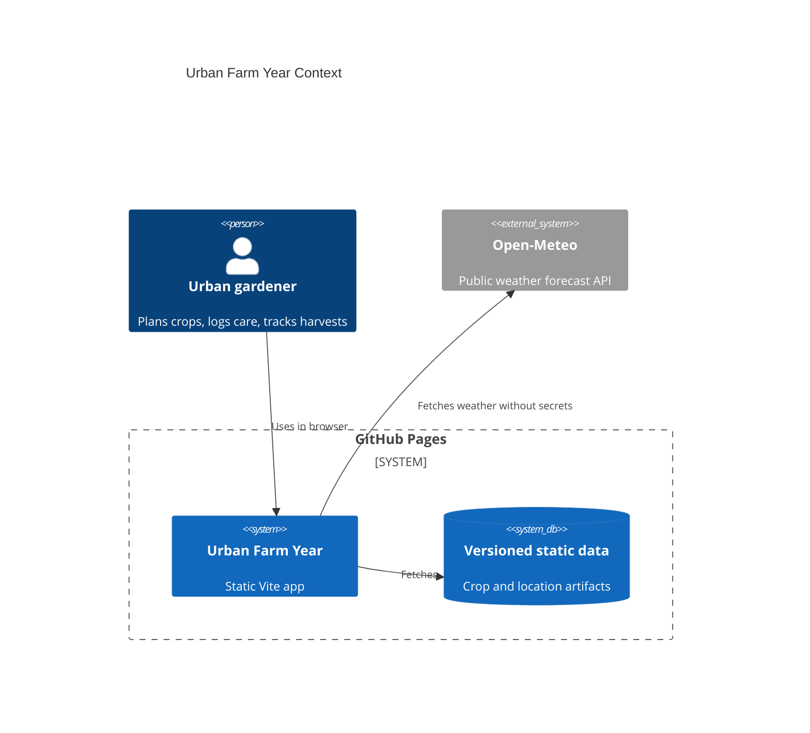
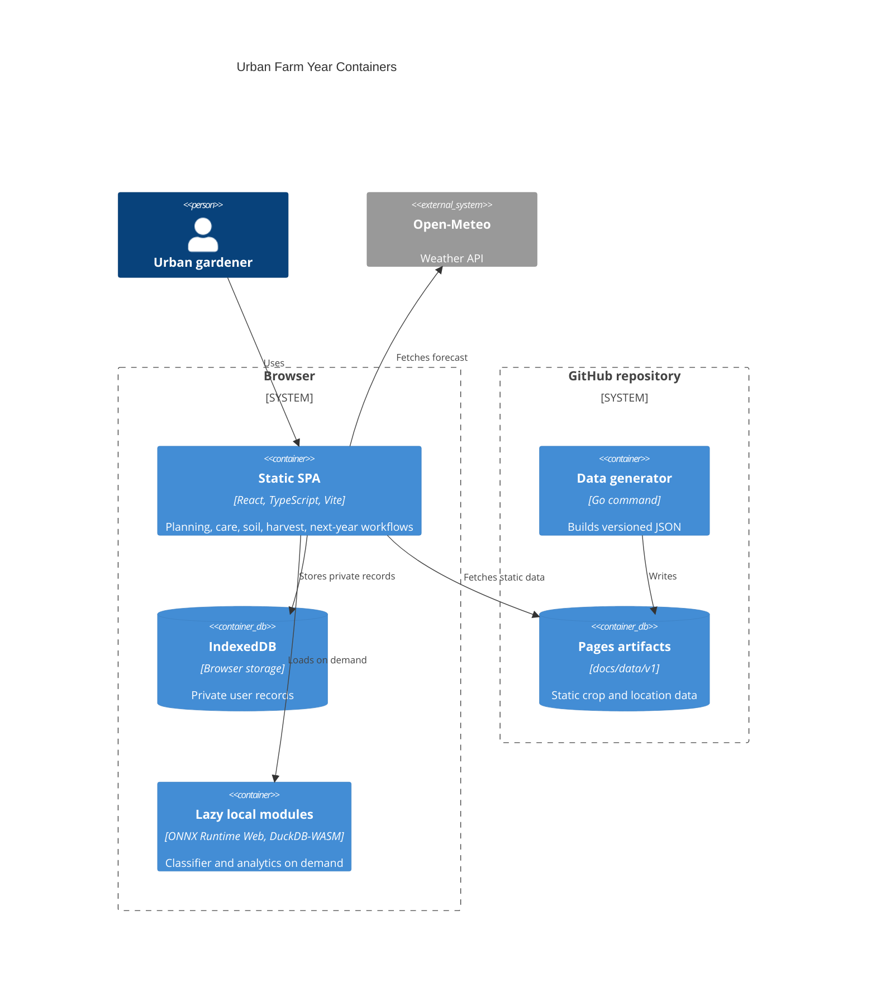

# Architecture

## Context

```mermaid
C4Context
  title Urban Farm Year Context
  Person(gardener, "Urban gardener", "Plans crops, logs care, tracks harvests")
  System_Boundary(pages, "GitHub Pages") {
    System(app, "Urban Farm Year", "Static Vite app")
    SystemDb(staticData, "Versioned static data", "Crop and location artifacts")
  }
  System_Ext(openMeteo, "Open-Meteo", "Public weather forecast API")
  Rel(gardener, app, "Uses in browser")
  Rel(app, staticData, "Fetches")
  Rel(app, openMeteo, "Fetches weather without secrets")
```

## Containers

```mermaid
C4Container
  title Urban Farm Year Containers
  Person(gardener, "Urban gardener")
  System_Boundary(browser, "Browser") {
    Container(spa, "Static SPA", "React, TypeScript, Vite", "Planning, care, soil, harvest, next-year workflows")
    ContainerDb(indexeddb, "IndexedDB", "Browser storage", "Private user records")
    Container(wasm, "Lazy local modules", "ONNX Runtime Web, DuckDB-WASM", "Classifier and analytics on demand")
  }
  System_Boundary(repo, "GitHub repository") {
    Container(generator, "Data generator", "Go command", "Builds versioned JSON")
    ContainerDb(artifacts, "Pages artifacts", "docs/data/v1", "Static crop and location data")
  }
  System_Ext(openMeteo, "Open-Meteo", "Weather API")
  Rel(gardener, spa, "Uses")
  Rel(spa, indexeddb, "Stores private records")
  Rel(spa, wasm, "Loads on demand")
  Rel(spa, artifacts, "Fetches static data")
  Rel(spa, openMeteo, "Fetches forecast")
  Rel(generator, artifacts, "Writes")
```
